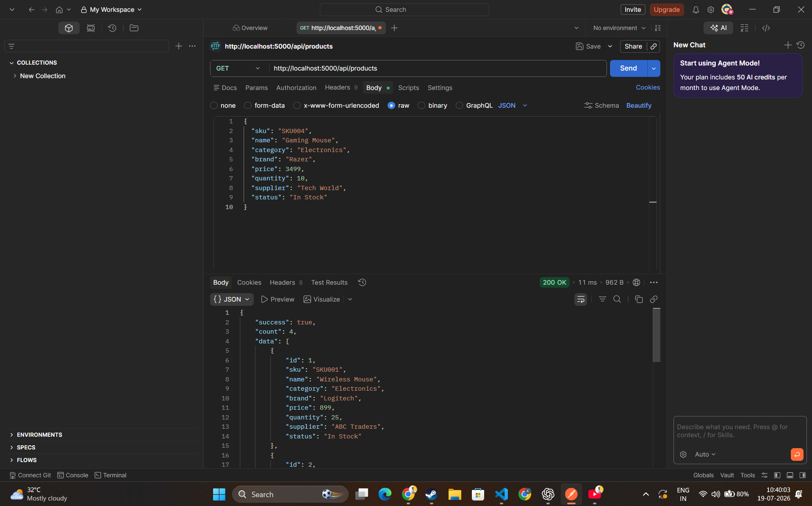
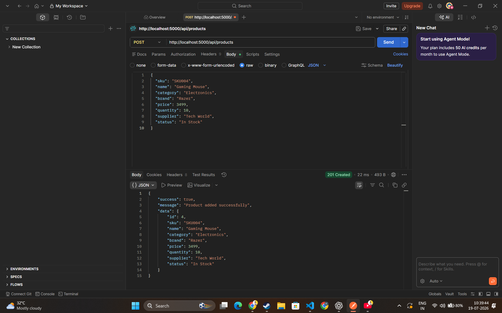
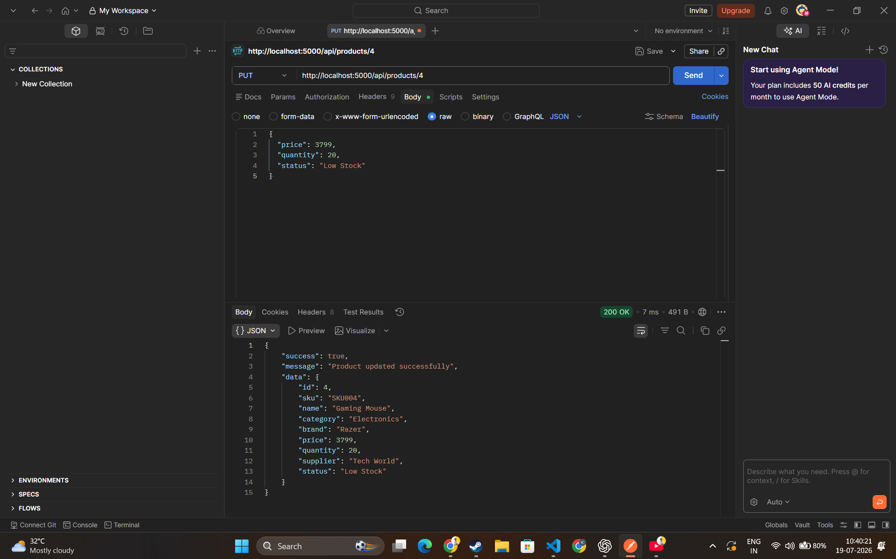

# 📦 Inventory Management REST API

A simple REST API built using **Node.js** and **Express.js** to perform CRUD (Create, Read, Update, Delete) operations on inventory products. The project stores data in an in-memory array and demonstrates the fundamentals of RESTful API development.

---

## 🚀 Features

- Get all products
- Get product by ID
- Add a new product
- Update an existing product
- Delete a product
- JSON request & response
- Proper HTTP status codes
- In-memory data storage (No Database)

---

## 🛠️ Technologies Used

- Node.js
- Express.js
- CORS
- Nodemon
- JavaScript
- Postman

---

## 📁 Project Structure

```
Task-2-Inventory-Management-REST-API
│
├── controllers
│   └── productController.js
│
├── data
│   └── products.js
│
├── routes
│   └── productRoutes.js
│
├── middleware
│
├── screenshots
│   ├── get.png
│   ├── post.png
│   ├── put.png
│   ├── get-by-id.png
│   └── delete.png
│
├── server.js
├── package.json
├── package-lock.json
└── README.md
```

---

## ⚙️ Installation

### Clone Repository

```bash
git clone <repository-url>
```

### Navigate to Project

```bash
cd Task-2-Inventory-Management-REST-API
```

### Install Dependencies

```bash
npm install
```

### Run Development Server

```bash
npm run dev
```

Server starts at:

```
http://localhost:5000
```

---

# 📌 API Endpoints

## Get All Products

```
GET /api/products
```

---

## Get Product By ID

```
GET /api/products/:id
```

Example

```
GET /api/products/1
```

---

## Add Product

```
POST /api/products
```

Example Body

```json
{
  "sku": "SKU004",
  "name": "Gaming Mouse",
  "category": "Electronics",
  "brand": "Razer",
  "price": 3499,
  "quantity": 10,
  "supplier": "Tech World",
  "status": "In Stock"
}
```

---

## Update Product

```
PUT /api/products/:id
```

Example

```json
{
  "price": 3799,
  "quantity": 20,
  "status": "Low Stock"
}
```

---

## Delete Product

```
DELETE /api/products/:id
```

---

# 📷 API Testing

The API was tested using **Postman**.

### GET All Products



---

### POST Product



---

### PUT Product



---

### GET Product By ID

> Add screenshot as `screenshots/get-by-id.png`

```text

```

---

### DELETE Product

> Add screenshot as `screenshots/delete.png`

```text

```

---

## 👨‍💻 Author

**Krishna Garg**